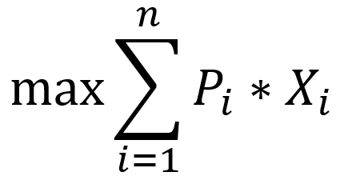
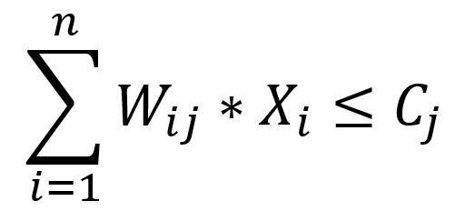

<h1 style="text-align:center">Multiple Constraints Knapsack</h1>

Bárbara Boechat, Juliana Araújo, Tiago Trotta 
Algoritmos Bioinspirados   Universidade Federal de São João del-Rei 

## Introdução

Buscar por soluções exatas para problemas combinatórios NP-Completos é uma tarefa difícil e exige grande esforço
computacional, sendo inviável o uso de métodos determinísticos para instâncias maiores. Contudo, existem vários
algoritmos heurísticos a serem utilizados como alternativa para este tipo de problema, como por exemplo, métodos
populacionais.

Estes métodos trabalham com diversas soluções simultaneamente através de processo iterativo, podem ou não alcançar
soluções de boa qualidade e até mesmo a solução ótima num tempo computacional razoável.

Neste trabalho, foi escolhido o Ant System, um algoritmo populacional [falar mais dele aqui], para a resolução de uma das variantes do _Knapsack Problem_ (Problema da Mochila), o
_Multiconstraints Knapsack Problem_ (MCKP).

## Modelagem do Problema

O MCKP é um problema de otimização combinatorial definido como o transporte de _n_ itens a ser realizado em uma mochila
que possui _m_ restrições e cada item possui um peso _Wij_ (_i = 1, 2, …, n_ e _j = 1, 2, …, m_) associado a cada uma
delas (totalizando _m x n_ restrições).

O objetivo do MCKP é maximizar o somatório do valor Pi que cada item possui. Cada item é representado por uma variável
binária no vetor solução _Xi_ que receberá o valor 1 se o item _i_ será levado ou 0 se não será levado. A equação abaixo
representa matematicamente o objetivo do problema:

  

Porém, a mochila possui _m_ restrições _Cj_ a serem respeitadas. E consequentemente, o somatório do peso
_Wij_ dos items a serem levados não deve ultrapassar esse valor. Tal limite representado matematicamente pela função:

  

